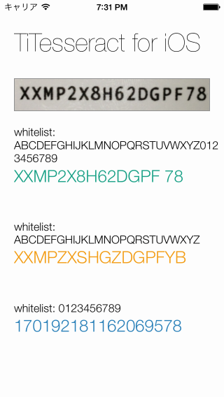

TiTesseract for iOS
=====================

About
-----

Titanium Mobile module for [tesseract-ios](https://github.com/ldiqual/tesseract-ios)



Requirements
------------

 - iOS SDK 6.0, iOS 5.0+ (there is no support for armv6)
 - Tesseract and Leptonica libraries from the [tesseract-ios-lib](https://github.com/ldiqual/tesseract-ios-lib) repo.
 - Objective-C wrapper for Tesseract OCR from the [tesseract-ios](https://github.com/ldiqual/tesseract-ios) repo.


Installation
------------
 - Put the `Classes` content (from [tesseract-ios](https://github.com/ldiqual/tesseract-ios)) somewhere in your project.
Edit Tesseract.h
 ```
#import <UIKit/UIKit.h>	// add
 ```
 - Download [tesseract-ios-lib](https://github.com/ldiqual/tesseract-ios-lib) and put it somewhere in your project.
 - Download [tessdata](https://code.google.com/p/tesseract-ocr/downloads/list) and put `tessdata` somewhere in your project.
 - Run `build.py` which creates your distribution
 - Copy net.appios.titesseract-iphone-X.X.X.zip into your app project of root directory
 - Build the project


Usage
------
 ```
var TiTesseract = require('net.appios.titesseract');

var ocrImage = Titanium.Filesystem.getFile(Titanium.Filesystem.resourcesDirectory + '/ocr.png');
var whitelist = 'ABCDEFGHIJKLMNOPQRSTUVWXYZ0123456789';
var lang = 'eng';
var recognizedText = TiTesseract.recognizedText(ocrImage.toBlob(), lang, whitelist);
 ```


License
-------
The MIT License (MIT) Copyright (c) 2013 Masayuki Sato.

Permission is hereby granted, free of charge, to any person obtaining a copy of this software and associated documentation files (the "Software"), to deal in the Software without restriction, including without limitation the rights to use, copy, modify, merge, publish, distribute, sublicense, and/or sell copies of the Software, and to permit persons to whom the Software is furnished to do so, subject to the following conditions:

The above copyright notice and this permission notice shall be included in all copies or substantial portions of the Software.

THE SOFTWARE IS PROVIDED "AS IS", WITHOUT WARRANTY OF ANY KIND, EXPRESS OR IMPLIED, INCLUDING BUT NOT LIMITED TO THE WARRANTIES OF MERCHANTABILITY, FITNESS FOR A PARTICULAR PURPOSE AND NONINFRINGEMENT. IN NO EVENT SHALL THE AUTHORS OR COPYRIGHT HOLDERS BE LIABLE FOR ANY CLAIM, DAMAGES OR OTHER LIABILITY, WHETHER IN AN ACTION OF CONTRACT, TORT OR OTHERWISE, ARISING FROM, OUT OF OR IN CONNECTION WITH THE SOFTWARE OR THE USE OR OTHER DEALINGS IN THE SOFTWARE.
